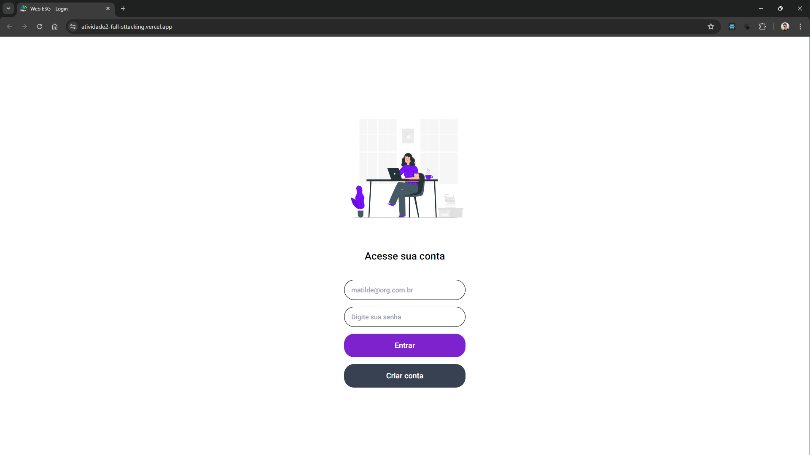

<div align="center" id="top"> 
  

&#xa0;

<a href="https://atividade2-full-sttacking.vercel.app/">Atividade2 FullStacking</a>

</div>

<h1 align="center">Atividade2 FullStacking</h1>

<p align="center">
  

  

  

  

  <!--  -->

  <!--  -->

  <!--  -->
</p>

<!-- Status -->

<!-- <h4 align="center">
	🚧  Ocean report 🚀 Under construction...  🚧
</h4>

<hr> -->

<p align="center">
  <a href="#dart-explicação-do-projeto">Sobre</a> &#xa0; | &#xa0;
  <a href="#rocket-tecnologias">Tecnologias</a> &#xa0; | &#xa0;
  <a href="#arrow_up-deploy">Links do Deploy</a> &#xa0; | &#xa0;
  <a href="#white_check_mark-requerimentos">Requerimentos</a> &#xa0; | &#xa0;
  <a href="#checkered_flag-starting">Starting</a> &#xa0; | &#xa0;
  <a href="#memo-autores">Autores</a>
</p>

<br>

## :dart: Explicação do projeto

AppDos primeiros passos ao protótipo.

Esta é uma atividade que pode ser desenvolvida de forma individual ou em grupo de no máximo 5 (cinco) integrantes.

Ao longo das fases iniciais de nosso 2º ano de estudos de Sistemas para Internet, temos pensado no desenvolvimento de uma Plataforma ESG e propondo ferramentas que auxiliem na utilização dos recursos naturais de nosso planeta de maneira sustentável.

Pensando nisso, desenvolva uma área da Plataforma ESG a escolha do seu time – área de usuário, cadastro de atividades, área informativa... decida, planeje e desenvolva!

O desenvolvimento deve contemplar uma área para o portal Web e a mesma área para o app Android.

## :rocket: Tecnologias

### As seguintes ferramentas foram usadas neste projeto:

#### Web

- [React](https://react.dev/)
- [ViteJs](https://vitejs.dev/)
- [Tailwind CSS](https://tailwindcss.com/)
- [React Router](https://reactrouter.com/en/main)
- [React Hook Form](https://react-hook-form.com/)
- [Lucide React](https://lucide.dev/)
- [Axios](https://axios-http.com/ptbr/)

#### Mobile

- [React](https://react.dev/)
- [React Native](https://reactnative.dev/)
- [Expo](https://expo.dev/)
- [Axios](https://axios-http.com/ptbr/)

#### Backend

- [Node](https://nodejs.org/en)
- [Fastify](https://fastify.dev/)
- [Typescript](https://www.typescriptlang.org/)
- [Prisma](https://www.prisma.io/)
- [Zod](https://zod.dev/)

## :arrow_up: Deploy

### Links do deploy (back e front) em funcionamento.

Front-end: [web](https://atividade2-full-sttacking.vercel.app/login)
Front-end: [mobile](https://snack.expo.dev/@lucasgomesdev/atividade2-fullstacking-mobile)
Back-end: [api](https://atividade2-fullsttacking-production.up.railway.app)

## :white_check_mark: Requerimentos

Antes de starting :checkered_flag:, você precisa ter [Git](https://git-scm.com) e [Node](https://nodejs.org/en/) instalados.

## :checkered_flag: Starting

### Mobile

Somente pelo snack

### Web

```bash
# Clone this project
$ git clone https://github.com/lucasgomesoficial/atividade2-FullSttacking.git

# Access
$ cd atividade2-FullSttacking/web

# Install dependencies
$ npm i

# Check Environment Variables
# Run the project
$ npm run dev

# The server will initialize in the <http://localhost:3000>
```

### Backend

```bash
# Clone this project
$ git clone https://github.com/lucasgomesoficial/atividade2-FullSttacking.git

# Access
$ cd atividade2-FullSttacking/server

# Install dependencies
$ npm i

# Check Environment Variables
# Next starting your migrations
$ npx prisma migrate

# Run the project
$ npm run dev

# The server will initialize in the <http://localhost:????>
```

## :memo: Autores

Feito com :heart: por &#xa0;
<a href="https://github.com/lucasgomesoficial" target="_blank">Lucas Gomes</a> &#xa0; | &#xa0;
<a href="https://github.com/juliamiliano1" target="_blank">Julia de Souza Miliano</a> &#xa0; | &#xa0;
<a href="https://github.com/gabelvs" target="_blank">Gabriela Alves</a> &#xa0; | &#xa0;
<a href="https://github.com/flavianecandido" target="_blank">Flaviane Alves Cândido</a> &#xa0; | &#xa0;
<a href="https://github.com/fvdsilva" target="_blank">Fernanda Viana</a>

&#xa0;

<a href="#top">Back to top</a>
